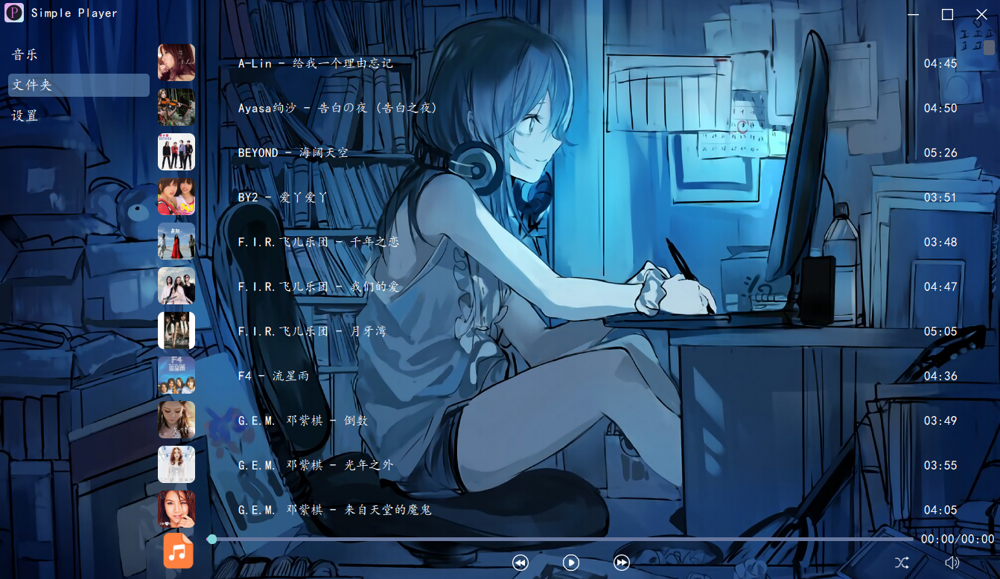

# Simple Player

[](https://www.python.org/)
[](https://pypi.org/project/PySide6/)
[](https://pypi.org/project/pygame/)
[](https://pypi.org/project/mutagen/)
[](https://github.com/YorickFin/Simple-Player)

一个简洁、美观、功能强大的本地音频播放器, 使用 Python 和 PySide6 开发。

## ✨ 功能特性

- 🎵 **音频播放控制**：播放、暂停、恢复、停止
- 🔊 **音量调节**：平滑的音量控制滑块
- ⏰ **播放进度**：实时显示播放时间和进度条
- 📁 **播放列表管理**：添加、删除、清空歌曲
- 🔄 **多种播放模式**：顺序播放、随机播放、单曲循环
- 🎨 **美观界面**：现代化的深色主题设计
- 📱 **系统托盘支持**：最小化到托盘, 随时控制
- 📝 **桌面歌词**：丰富的自定义外观, 支持字体、颜色、位置等设置
- 🔍 **音频文件信息**：显示歌曲标题、艺术家等信息
- 🛠️ **配置管理**：个性化设置保存

## 📦 安装说明

### 1. 克隆项目

```bash
git clone https://github.com/YorickFin/simple-player.git
cd simple-player
```

### 2. 安装依赖

项目使用 Python 3.13+, 依赖包通过 `uv` 安装：

```bash
uv sync
```


### 3. 运行应用

```bash
python main.py
```

## 📁 项目结构

```
Simple Player/
├── res/                # 资源文件夹
│   ├── background/     # 背景图片
│   ├── config/         # 配置文件
│   ├── img/            # 界面图标
│   ├── logo/           # 应用图标
│   ├── qrc/            # Qt 资源文件
│   ├── qss/            # Qt 样式表
│   ├── ui/             # UI 设计文件
│   └── *.py            # 资源相关脚本
├── src/                # 源代码文件夹
│   ├── audio_extract.py # 音频提取工具
│   └── player.py       # 播放器核心类
├── .gitignore          # Git 忽略文件
├── .python-version     # Python 版本指定
├── README.md           # 项目说明
├── main.py             # 应用主入口
└── pyproject.toml      # 项目配置和依赖
```

## 🔧 技术栈

- **编程语言**：Python 3.13+
- **GUI 框架**：PySide6
- **音频处理**：Pygame
- **音频元数据**：Mutagen
- **界面设计**：Qt Designer

## 🎨 界面预览

### 主界面



### 桌面歌词


## 🤝 贡献

欢迎贡献代码、报告问题或提出建议！

1. Fork 本项目
2. 创建特性分支 (`git checkout -b feature/amazing-feature`)
3. 提交更改 (`git commit -m 'Add some amazing feature'`)
4. 推送到分支 (`git push origin feature/amazing-feature`)
5. 开启 Pull Request

## 📄 许可证

本项目基于 GPL-3.0 许可证开源, 欢迎使用与二次开发, 详情请参阅 [LICENSE](LICENSE) 文件

## 👨‍💻 开发者

- **作者**：[GitHub主页](https://github.com/YorickFin)

---

❤️ 感谢使用 Simple Player！如果您喜欢这个项目, 请给它一个 ⭐ 支持一下！